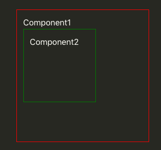

# Why would we want to learn React?

Let's assume that we were tasked by our client to create 10 pages of content for the company's website, all with the same navigation bar.

We proceed to design the navigation bar and placed them into 10 different pages.

Here are some examples of the pages.

|             index.html             |             profile.html              |
| :--------------------------------: | :-----------------------------------: |
|  |  |

**\*Phone rings**

Oh noes, the client wanted the color of the navigation bar to be changed to `#edfaff`.

## Welp, let's get to work then.

We proceed to change the color of the navigation bar and replaced the navigation bar in the pages.

|             index.html              |             profile.html              |
| :---------------------------------: | :-----------------------------------: |
|  |  |

**\*Client called again!**

Whoops!! We've forgotten to apply the change to a few of the pages.

---

Accidents like this happen all the time, as a website is always comprised of many HTML pages. We are not perfect human beings, making mistakes here and there is perfectly normal!

---

## Let's see how we can solve this problem using React!

First I would need to explain what is React.

React is a front-end library that is built on JavaScript, in essence, it's just a bunch of functions and code written in JavaScript, the main purpose of these codes is to make developer's life easier by solving the above problems and more.

In React, a developer would first define an HTML template in JavaScript, that template will be what we call a `component`.

```
You can think of it as an abbreviation/container for a bunch of HTML, very cool right?
```

The said `component` can be used anywhere, even in other `component`.



However, to solve the above problem with only React is insufficient, so we have to apply a concept called `source of truth`.

## Source of truth

Let me briefly explain a concept known as `source of truth`.

For every page of HTML we have, we will have a navigation bar for it. Since changing the navigation bar of one of the pages will not change the rest of the pages, we can say that they are from a separate source of truth. For the above example, we would have 10 different sources of truth for the navigation bar.

Our goal is to get every single HTML page to use a navigation bar template from only one `source of truth`. Hence, if there are any changes needed, we only need to change from that `source of truth` which will then be applied onto all the pages simultaneously.

## SOLUTION!

So now we roughly know what React is and also understand the concept of `source of truth` we can now implement them to solve our problem.

A template of our navigation bar can be defined in our `component`, the `component` defined is now the one `source of truth` for our navigation bar.

Although some setups are still required for React, but after all of that, you can use the defined component like so.

```HTML
<body>
  <MyNavBar /> <!-- This is a component -->
</body>
```

The `<MyNavBar /> component` above will recreate all the HTML that are defined inside of it. We can then repeat this on the other pages so that they will all use the same `component`, thus achieving one single `source of truth` for the navigation bar!

```HTML
Contents of components can be tweaked according to your needs. For example,

<MyNavBar />

The above navigation bar can have a default title, maybe the name of the company or app.

<MyNavBar title='My Custom Title' />

But the title can also be configured to be customizable.
```

## Can't we achieve it using JavaScript?

Technically speaking, you **can**!

By using only HTML or combining it with JavaScript, it is entirely possible to implement the concept of one source of truth, but it's not a common practice to do it and it has some drawbacks as well. If you want to know why read more [here](further-reading.md)!

So why do we prefer React over JavaScript?

## Write less, achieve more.

## Decrease development time, increase productivity.

React offers reusable `component`s, which means that the HTML that we write in React are all potentially reusable, thus reducing the amount of code needed significantly.

```
It feels like using a photostat machine versus handwriting documents.
```

---

## More organized code, faster debugging time.

React also allows easier logic implementation. For example, if we have an email input field that needs to be checked for a valid email, its logic can be easily be contained in one `component`, and then be reused whenever we need it.

Logical bugs can also be tracked down fairly easily. If a `component` isn't behaving as it should, since all logics for a `component` is contained within one single file, the bug can be found within a short amount of time.

---

## Same structure, different platform.

After learning how to work with React, we can easily start working with React Native!

With React Native, we can now develop mobile apps for both Android and iOS platforms.

Write only one React Native app, and it can then be 'translated' into both Android and iOS apps, so you don't have to write both!

React Native is structurally similar to React. So you would only have to learn the nuances of React Native!

---

## Conclusion

React is a really powerful tool that a frontend developer can use to increase productivity and reduce development time. This is especially important when we are working with big projects where we have to work with a lot of pages.

~~**PSST! More jobs done in a shorter amount of time means more \$\$.**~~

The demand for frontend developers who knows how to work with React is on the rise right now, so learning React will also increase the chance of getting a job as well!

If you're interested in signing up for our React Bootcamp...
